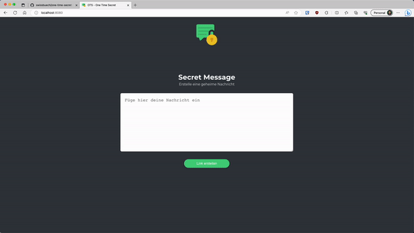

# OTS - One Time Secret

## Demo

## Production

Generate self signed certificate:

`openssl req -x509 -newkey rsa:4096 -keyout vault/config/cert.key -out vault/config/cert.pem -days 36525 -subj "/CN=localhost" -addext "subjectAltName = DNS:localhost,DNS:vault" -nodes`

## Customization

### Favicon

- Generate your icons: <https://favicon.io/favicon-converter/>
- Mount files to docker volume `app/static/icons`

### Logo

- Mount logo to docker volume `app/static/img/logo/logo.png`

### Custom CSS

`app/static/css/custom.css`

### Custom Font

`app/static/font/font.ttf`

## Development

`docker compose -f compose-dev.yml up --build`

## Credits

### Project

- [sup3rS3cretMes5age](https://github.com/algolia/sup3rS3cretMes5age)

### Icon

- <a href="https://www.flaticon.com/free-icons/secret" title="secret icons">Secret icons created by juicy_fish - Flaticon</a>